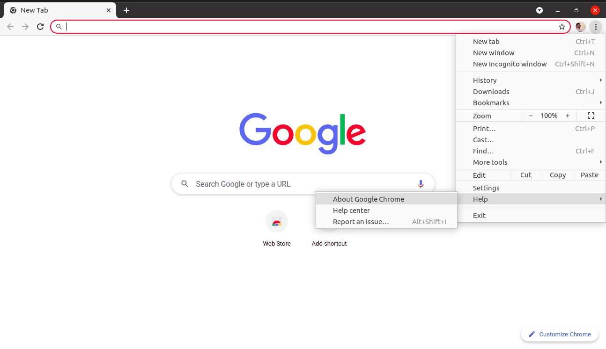
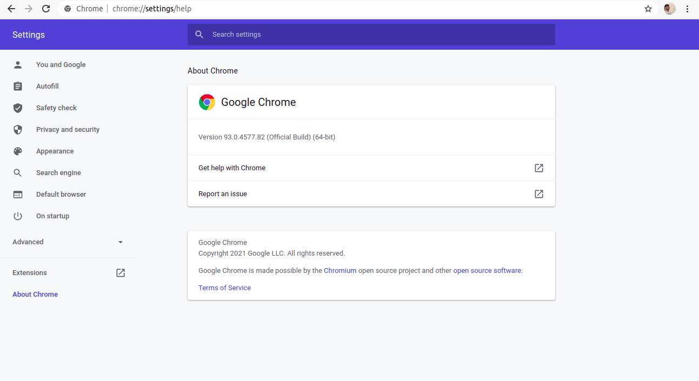

# Automação com Selenium e Python
O objetivo deste projeto é realizar a automação de três casos de teste especificados abaixo utilizando a biblioteca Selenium na linguagem de programação Python.
## Glossário
<ul>
  <li> Dependências
  <li> Como instalar 
  <li> Como executar
  <li> Casos de teste
</ul>

## Dependências
<ul>
  <li> Python 3.10.4
  <li> Biblioteca Selenium
  <li> Chromedriver    
</ul>

## Como instalar
O tutorial será direcionado para execução no sistema operacional Windows, visto que este foi o sistema utilizado pelo autor para execução dos testes.
### Python 3.10.4
Acessar o link https://www.python.org/downloads/, realizar o download do Python e seguir o passo a passo previsto.

### Biblioteca Selenium
Com o Python instalado na máquina, abrir o prompt de comando no mesmo diretório do arquivo 'requirements.txt' fornecido aqui no repositório e executar o comando ```pip install -r requirements.txt```
### Chromedriver
Para realizar o teste de um sistema Web através de um navegador é necessário ter instalado o webdriver do navegador a ser utilizado, no caso deste projeto o navegador 
escolhido foi o Google Chrome. Para realizar a instalação, primeiramente é necessário saber qual a versão atual do seu navegador chrome, que pode ser encontrada seguindo 
os passos demonstrados nas imagens a seguir:



Depois de identificar a versão do chrome, acessar o link https://chromedriver.chromium.org/downloads, selecionar a versão verificada anteriormente nas imagens e baixar o 
arquivo "chromedriver_win32.zip". Após concluído o download, abrir o diretório onde o arquivo foi baixado, descompactar o arquivo compactado e mover o arquivo 'chromedriver.exe'
para o ```PATH: "C:\Windows"```. Tendo feito tudo isso você pode confirmar a instalação do chromedriver 
através do comando ```chromedriver --version```


## Como executar
Para realizar a execução é necessário haver a versão mais recente deste repositório. Dessa forma, você precisa baixar o repositório manualmente ou realizar um git pull 
através do terminal ou pela IDE utilizada. Após isso, é apenas executar o arquivo `test_cases.py`, ele abrirá o browser três vezes para verificar os casos de teste e apresentará
um relatório de execução no final. 

## Casos de teste

 <b> Caso de teste 01: Registrar usuário</b>
  <br>Passos:
  <ol>
    <li> Abrir o browser
    <li> Acessar a página: https://www.grocerycrud.com/v1.x/demo/my\_boss\_is\_in\_a\_hurry/bootstrap
    <li> Mudar o valor da combo Select version para “Bootstrap V4 Theme”
    <li> Clicar no botão Add Customer
    <li> Preencher os campos do formulário com as seguintes informações:<br>
            Name: Tcc <br>
            Last name: Gabriel <br>
            ContactFirstName: Teste <br>
            Phone: 51 9999-9999 <br>
            AddressLine1: Av Darcy Vargas, 1200 <br>
            AddressLine2: Stem <br>
            City: Manaus <br>
            State: AM <br>
            PostalCode: 69050-020 <br>
            Country: Brasil <br>
            from Employeer: Fixter <br>
            CreditLimit: 200 <br>
    <li> Clicar no botão Save
    <li> Validar a mensagem “Your data has been successfully stored into the database. Edit Customer or Go back to list” através de uma asserção
    <li> Fechar o browser
  </ol>
  <br>
 <b> Caso de teste 02: Remover usuário </b>
 <br>Passos:
  <ol>
    <li> Abrir o browser
    <li> Acessar a página: https://www.grocerycrud.com/v1.x/demo/my\_boss\_is\_in\_a\_hurry/bootstrap
    <li> Mudar o valor da combo Select version para “Bootstrap V4 Theme”
    <li> Clicar no botão Add Customer
    <li> Preencher os campos do formulário com as seguintes informações:<br>
            Name: Tcc <br>
            Last name: Gabriel <br>
            ContactFirstName: Teste <br>
            Phone: 51 9999-9999 <br>
            AddressLine1: Av Darcy Vargas, 1200 <br>
            AddressLine2: Stem <br>
            City: Manaus <br>
            State: AM <br>
            PostalCode: 69050-020 <br>
            Country: Brasil <br>
            from Employeer: Fixter <br>
            CreditLimit: 200 <br>
    <li> Clicar no botão "Save and go back to list"
    <li> Clicar na coluna “Search Name” e digitar o conteúdo do Name (Tcc)
    <li> Clicar no checkbox abaixo da palavra Actions
    <li> Clicar no botão Delete
    <li> Validar o texto “Are you sure that you want to delete this 1 item?” através de uma
    asserção para a popup que será apresentada
    <li> Clicar no botão Delete da popup, aparecerá uma mensagem dentro de um box verde
    na parte superior direito da tela. Adicione uma asserção na mensagem “Your data has
    been successfully deleted from the database.”
    <li> Fechar o browser
  </ol>
  <br>
 <b> Caso de teste 03: Verificar colunas </b>
 <br>Passos:
  <ol>
    <li> Abrir o browser
    <li> Acessar a página: https://www.grocerycrud.com/v1.x/demo/my\_boss\_is\_in\_a\_hurry/bootstrap
    <li> Verificar se a primeira coluna se chama "Actions"
    <li> Verificar se a segunda coluna se chama "CustomerName"
    <li> Verificar se a terceira coluna se chama "Phone"
    <li> Verificar se a quarta coluna se chama "AddressLine1"
    <li> Verificar se a quinta coluna se chama "CreditLimit"
    <li> Fechar o browser
  </ol>
